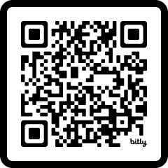
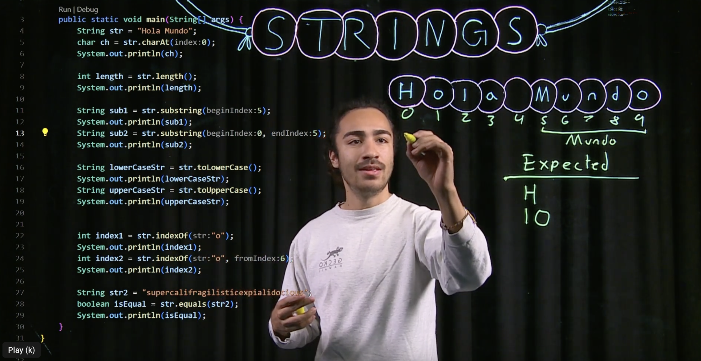
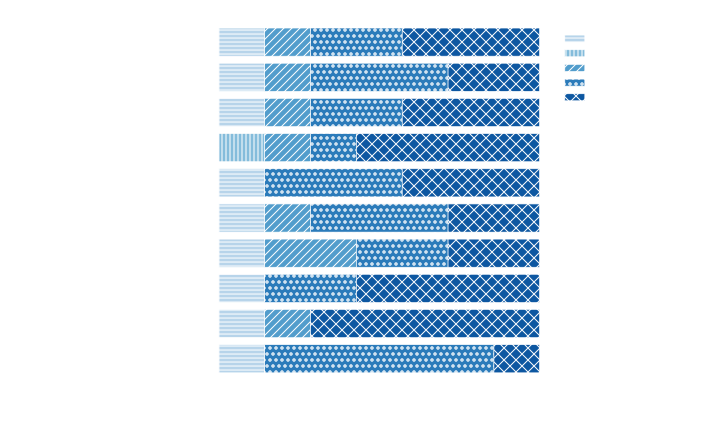

[comment]: # (Compile this presentation with the command below)
[comment]: # (mdslides index.md && mv index/index.html .)
[comment]: # (THEME = night)
[comment]: # (CODE_THEME = base16/zenburn)
[comment]: # (The list of themes is at https://revealjs.com/themes/)
[comment]: # (The list of code themes is at https://highlightjs.org/)
[comment]: # (Pass optional settings to reveal.js:)
[comment]: # (controls: true)
[comment]: # (keyboard: true)
[comment]: # (progress: true)
[comment]: # (width: "1024")
[comment]: # (markdown: { smartypants: true })
[comment]: # (hash: false)
[comment]: # (respondToHashChanges: false)
[comment]: # (Other settings are documented at https://revealjs.com/config/)

#### Student Reflections on Relating Programming Concepts to Their Lives in Worked Example Videos
----------

Kevin Buffardi and Richert Wang

</img>

[LearnByFailure.com](https://learnbyfailure.com/)

[comment]: # (!!!)

#### Why Personalized Coding Examples?

* Computing impacts increasingly broad applications
* Intro materials often [reflect narrow interests (e.g. games, robitics)](https://learnbyfailure.com/interests/)
* Many students struggle to see how coding relates to their own lives
* Goal: broaden participation by connecting programming to **students' lived experiences**

[comment]: # "!!!"

#### Five Years of codewit.us

* <a href="https://codewit.us/" target="_blank">Codewit.us</a> and <a href="https://www.youtube.com/@codewit/videos" target="_blank">Codewit @ Youtube</a>
* Undergraduate "peer instructors" created coding tutorials
* Intro topics (e.g. data types, control flow, functions) in C++, Java, Python

Examples connected coding to:

* Athletics
* Music
* Arts and crafts
* Personal productivity
* "Adulting"

[comment]: # "|||"

</img>

[comment]: # "|||"

#### Research Questions

Common question at research presentations:

**How can** *my* **students do this too?!**

* **RQ1** What motivations, challenges, and successes did peer-instructors experience?
* **RQ2** How can watching and creating worked examples motivate learning computer science?
* **RQ3** How can the process and tools best support students in creating their own worked examples?
* **RQ4** How did creating worked examples impact their identities and self-perceptions as computer scientists?

[comment]: # "!!!"

#### Participants & Context

* 12 peer instructors hired across project phases

  * California State University, Chico (Chico State)
  * University of California, Santa Barbara (UCSB)
  * Diverse academic pathways and backgrounds
  * Weekly mentoring and feedback sessions

[comment]: # "|||"

#### Process

Peer instructors were encouraged to:

1. Choose unique, personally meaningful contexts
2. Explain concepts in their own words
3. Demonstrate concepts through worked examples

[comment]: # "|||"

### Methods

#### Focus Groups

* Fall 2025
* 2 focus groups (online video conference)
* 7 of 12 eligible peer instructors participated
* One-hour semi-structured discussions

[comment]: # "||| data-auto-animate"

### Methods

#### Questionnaire

* 10 Likert-scale items
* Examined perceived impacts of creating tutorial videos

[comment]: # "||| data-auto-animate"

### Methods

#### Analysis

* Thematic analysis
* Independent coding by two researchers
* Consensus-building on themes

[comment]: # "!!!"

#### RQ1: Why Did Students Participate?

Participants described motivations including:

* Enjoyment of tutoring and teaching
* Reinforcing programming fundamentals
* Interest in communication and mentoring
* Flexible employment opportunity
* Desire to help future learners

Teaching programming was viewed as a way to deepen their own understanding

[comment]: # "||| data-auto-animate"

#### RQ1: Creating Personal Examples

Common idea-generation strategies:

* Drawing from hobbies and interests
* Connecting concepts to everyday life
* Using personal memories and stories
* Relating coding to their academic discipline
* Brainstorming with peers

[comment]: # "||| data-auto-animate"

#### RQ1: Challenges

Participants reported difficulty:

* Overcoming writer's block
* Balancing creativity and accuracy
* Keeping examples appropriately scoped
* Isolating concepts for beginners
* Creating examples distinct from peers

[comment]: # "||| data-auto-animate"

#### RQ1: Challenges

Most helpful supports:

* Weekly brainstorming meetings
* Peer collaboration
* Faculty feedback
* Iterative revision

[comment]: # "!!!"

### RQ2: Motivating Learners

Two themes emerged:

#### 1. Personal Connection

* Storytelling
* Enthusiasm
* Charisma
* Peer-like communication

[comment]: # "||| data-auto-animate"

### RQ2: Motivating Learners

Two themes emerged:

#### 2. Concrete Applications

* Games
* Robotics
* Simulations
* Real-world tools

[comment]: # "||| data-auto-animate"

### RQ2: Motivating Learners

Two themes emerged:

1. Personal Connection - female focus group (n=4)
2. Concrete Applications - male focus group (n=3)

[comment]: # "!!!"

### RQ3: Supporting Student Creativity

#### Recommendations from participants:

* Start with broad ideas
* Refine into concrete examples
* Observe everyday experiences
* Use structured prompts
* Allow time for reflection

[comment]: # "||| data-auto-animate"

### RQ3: Supporting Student Creativity

#### Collaboration Matters

* Individual brainstorming first
* Small-group discussion second
* Peer feedback throughout

Participants recommended students **create their own examples** rather than shared group examples

[comment]: # "||| data-auto-animate"

### RQ3: Supporting Student Creativity

#### Helpful Tools & Processes

Participants valued:

* Live coding environments
* Screen recording tools
* Visual annotation
* Diagrams and drawings
* Video editing software
* Feedback (self, peer, faculty)

> Participants reported becoming more comfortable and efficient over time.

[comment]: # "!!!"

### RQ4: Impact on Identity

Participants reported:

* Stronger understanding of fundamentals
* Increased confidence as programmers
* Improved debugging ability
* Better communication skills
* Greater appreciation for teaching

[comment]: # "||| data-auto-animate"

### RQ4: Impact on Identity

Many connected the experience to:

* Technical interviews
* Internships
* Professional communication

[comment]: # "||| data-auto-animate"

### RQ4: Impact on Identity

#### Questionnaire Results

[comment]: # "!!!"

### Recommended Framework

**Ideation** 

**Drafting** 

**Revision** 

**Teaching** 

[comment]: # "||| data-auto-animate"

### Recommended Framework

**Ideation** 

Connect programming concepts to:

* Interests
* Experiences
* Goals
* Cultural contexts

[comment]: # "||| data-auto-animate"

### Recommended Framework

**Drafting** 

* Translate ideas into working code
* Test and validate code
* Draft accompanying illustrations

[comment]: # "||| data-auto-animate"

### Recommended Framework

**Revision** 

* Practice explaining and refining the example
* Iterate on feedback from self/peers/instructor

[comment]: # "||| data-auto-animate"

### Recommended Framework

**Teaching** 

* Deliver example through video or presentation

[comment]: # "!!! data-auto-animate"

### Key Takeaways

* Students successfully connected coding concepts to lived experiences
* Creating examples was both challenging and rewarding
* Feedback and collaboration were essential
* Individual examples preferred, with peer feedback
* The activity strengthened confidence and communication skills
* Personalized worked examples provide a practical strategy for broadening participation in computing

[comment]: # "!!!"

#### Student Reflections on Relating Programming Concepts to Their Lives in Worked Example Videos

<small>Presentation: [learnbyfailure.com/reflections-asee2026/](https://learnbyfailure.com/reflections-asee2026/) and source: [GitHub](https://github.com/kbuffardi/reflections-asee2026/).</small>

<small>This material is based upon work supported in part by the [National Science Foundation](https://www.nsf.gov/awardsearch/show-award/?AWD_ID=2315883&HistoricalAwards=false) and by the [Learning Lab](https://calearninglab.org/project/python-4-all/), an initiative of California Governor’s Office of Planning and Research. Any opinions, findings, and conclusions or recommendations expressed in this material are those of the authors and do not necessarily reflect the views of the funders.</small>

</img>

<small>[Back to LearnByFailure](https://learnbyfailure.com/research/)
</small>
